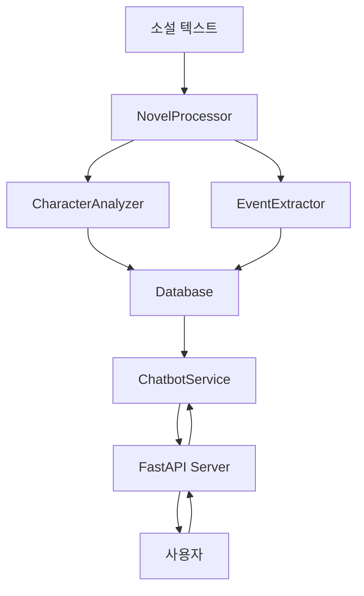

# 소설 캐릭터 챗봇 (Novel Character Chatbot)

## 프로젝트 소개
소설의 내용을 분석하여 등장인물들의 성격, 배경, 관계 등을 학습하고, 이를 바탕으로 캐릭터와 대화할 수 있는 AI 챗봇 시스템입니다.

## 블로그
[블로그 작성 글](https://youngri.tistory.com/68)


## 예시


<div style="display: flex;">
  
  
</div>
  


## 아키텍처


## 주요 기능

### 1. 소설 학습 프로세스
1. **텍스트 전처리**
   - 소설 텍스트를 청크 단위로 분할
   - 캐릭터 이름 및 별칭 추출

2. **캐릭터 분석**
   - 성격 특성 (traits)
   - 가치관 (values)
   - 동기 (motivations)
   - 두려움 (fears)
   - 배경 정보 (background)
   - 관계 정보 (relationships)

3. **이벤트 추출**
   - 각 챕터별 주요 사건 추출
   - 캐릭터 관련 사건 연결

### 2. 대화 시스템
- GPT-4o-mini 기반 대화 생성
- 캐릭터 성격 반영
- 대화 기록 유지
- 이벤트 컨텍스트 활용

## 기술 스택
- FastAPI
- LangChain
- OpenAI GPT-4
- Firebase Firestore
- Python 3.11

## 주요 컴포넌트

### NovelProcessor

```17:350:ai/services/novel_processor.py
class NovelProcessor:
    def __init__(self, settings):
        self.settings = settings
        self.name_resolver = NameResolver()
        self.logger = NovelLogger()
        self.llm = ChatOpenAI(
            temperature=0,
            model="gpt-4o-mini",
            openai_api_key=settings.OPENAI_API_KEY
        )
        self.embeddings = OpenAIEmbeddings(
            openai_api_key=settings.OPENAI_API_KEY
        )
        self.vector_store = VectorStore(settings)
        self.text_splitter = NovelTextSplitter(
            chunk_size=settings.CHUNK_SIZE,
            chunk_overlap=settings.CHUNK_OVERLAP
        )
    async def process_novel(self, title: str, content: str, author: str) -> Dict:
        """소설 전체 처리"""
        try:
            self.logger.log_processing_start("Novel Processing")
            
            # 소설 ID 생성
            novel_id = str(uuid.uuid4())
            
            # DB에 소설 정보 저장 (동기식)
            db = DatabaseService()
            db.save_novel(novel_id, title, content, author) # 굳이 저장을 해야할까??
            
            # 1. 초기 캐릭터 식별
            characters = await self._identify_characters(content, novel_id)
            if not characters:
                raise NovelProcessingError("No characters found in the novel")
            
            for char in characters:
                self.name_resolver.add_character(char['full_name'], char['aliases'])
                self.logger.log_character_found(char['full_name'], char)
                
                # 캐릭터 정보 저장 (동기식)
                db.save_character({
                    'id': str(uuid.uuid4()),
                    'novel_id': novel_id,
                    **char
                })
            
            # 2. 텍스트 분할
            chunks = self.text_splitter.split_text(content)
            if not chunks:
                raise NovelProcessingError("Failed to split text into chunks")
            
            # 3. 각 청크 처리
            all_events = []
            for i, chunk in enumerate(chunks):
                try:
                    normalized_chunk = self._normalize_names(chunk)
                    events = await self._extract_events(normalized_chunk, i)
                    for event in events:
                        # 이벤트 저장 (동기식)
                        event['id'] = str(uuid.uuid4())
                        event['novel_id'] = novel_id
                        db.save_event(event)
                        self.logger.log_event_extracted(event['summary'], i)
                    all_events.extend(events)
                except Exception as e:
                    self.logger.log_error(f"Error processing chunk {i}", {"error": str(e)})
                    continue
            if not all_events:
                self.logger.log_error("No events extracted from the novel")
            
            result = {
                "characters": characters,
                "events": all_events
            }
            
            return {
                "novel_id": novel_id,
                "title": title,
                "author": author,
                **result
            }
            
        except Exception as e:
            self.logger.log_error("Novel processing failed", {"error": str(e)})
            raise NovelProcessingError("Failed to process novel", {"error": str(e)})
    def _normalize_names(self, text: str) -> str:
        """텍스트 내의 모든 캐릭터 이름을 정규화"""
        words = text.split()
        normalized_words = []
        
        for word in words:
            # 이름이면 전체 이름으로 변환
            full_name = self.name_resolver.resolve_name(word)
            normalized_words.append(full_name)
        
        return ' '.join(normalized_words)
    async def _identify_characters(self, content: str, novel_id: str) -> List[Dict]:
        try:
            # 1. 먼저 기본적인 캐릭터 추출
            initial_characters = await self._extract_characters_from_events(content)
            if not initial_characters:
                self.logger.log_error("No initial characters found")
                return []
            
            # 2. 각 캐릭터에 대해 상세 분석
            enriched_characters = []
            chunks = [content[i:i+3000] for i in range(0, len(content), 2500)]
            
            for char in initial_characters:
                char_info = await self._analyze_single_character(char["full_name"], chunks[:5])
                if char_info:
                    enriched_characters.append(char_info)
            
            if not enriched_characters:
                self.logger.log_error("No enriched characters found")
                return [{
                    "full_name": "주인공",
                    "aliases": ["그", "그는"],
                    "initial_description": "소설의 주인공",
                    "personality": {"traits": ["미상"], "values": ["미상"], 
                                  "motivations": ["미상"], "fears": ["미상"]},
                    "background": {"origin": "미상", "occupation": "미상", "skills": []},
                    "story_role": "주인공",
                    "relationships": []
                }]
            
            return enriched_characters
            
        except Exception as e:
            self.logger.log_error(f"Failed to identify characters: {str(e)}")
            raise NovelProcessingError(f"Failed to identify characters: {str(e)}")
    async def _extract_characters_from_events(self, content: str) -> List[Dict]:
        prompt = PromptTemplate(
            input_variables=["text"],
            template="""
            다음 텍스트에서 실제 등장인물만을 찾아 JSON 형식으로 반환하세요.
            대명사나 일반 명사가 아닌 실제 캐릭터만 추출하세요.

            예시:
            - "그", "그녀", "나", "너" 같은 대명사는 제외
            - "사람들", "누군가" 같은 불특정 명사는 제외
            - "청년", "소녀" 같은 일반 명사는 구체적인 캐릭터를 지칭할 때만 포함

            반드시 다음 형식으로 반환해주세요:
            {{
                "characters": [
                    {{
                        "full_name": "캐릭터의 실제 이름",
                        "aliases": ["다른 호칭이나 별명"],
                        "initial_description": "캐릭터 설명",
                        "role": "역할 (예: 주인공, 적대자 등)"
                    }}
                ]
            }}
            
            텍스트:
            {text}
            """
        )
        
        try:
            chunks = [content[i:i+3000] for i in range(0, len(content), 2500)]
            all_characters = {}
            
            for chunk in chunks[:5]:
                chain = prompt | self.llm
                response = await chain.ainvoke({"text": chunk})
                
                try:
                    content = response.content.strip()
                    if '```json' in content:
                        content = content.split('```json')[1].split('```')[0]
                    
                    result = json.loads(content)
                    if "characters" in result:
                        for char in result["characters"]:
                            name = char["full_name"]
                            if name not in all_characters:
                                all_characters[name] = char
                            else:
                                # 기존 정보와 병합
                                self._merge_character_info(all_characters[name], char)
                
                except json.JSONDecodeError:
                    self.logger.log_error(f"Failed to parse characters from chunk")
                    continue
            
            return list(all_characters.values())
            
        except Exception as e:
            self.logger.log_error(f"Error extracting characters: {str(e)}")
            return []
    def _merge_character_info(self, existing: Dict, new: Dict) -> None:
        """캐릭터 정보 스마트 병합"""
        # 병합 로직 비활성화
        return new  # 새로운 데이터만 반환
                existing[key] = value
    def _try_partial_parsing(self, content: str, all_characters: Dict) -> None:
        """부분적 파싱 시도"""
        # 파싱 실패 시 부분적으로 파싱 시도
        for line in content.split('\n'):
            line = line.strip()
            if not line:
                continue
            current_obj = line
                            [v for v in sub_value if v not in existing[key][sub_key]]
            try:
                # 전체 객체를 파싱 시도
                data = json.loads(current_obj)
                
                # 중첩된 객체 처리
                if isinstance(data, dict):
                    if 'full_name' in data:  # 단일 캐릭터
                        all_characters[data['full_name']] = data
                    else:  # 여러 캐릭터가 포함된 객체
                        for char_data in data.values():
                            if isinstance(char_data, dict) and 'full_name' in char_data:
                                char_data.setdefault('aliases', [])
                                char_data.setdefault('initial_description', '')
                                all_characters[char_data['full_name']] = char_data
                current_obj = ""
            except json.JSONDecodeError:
                continue
                    if 'full_name' in data:  # 단일 캐릭터
    def _parse_character_response(self, response: str) -> List[Dict]:
        """LLM 응답을 파싱하여 캐릭터 정보로 변환"""
        try:
            # 응답 문자열을 여러 JSON 객체로 분리
            json_objects = []
            current_obj = ""
            for line in response.split('\n'):
                line = line.strip()
                if not line:
                    continue
                current_obj += line
                
                try:
                    # 전체 객체를 파싱 시도
                    data = json.loads(current_obj)
                    
                    # 중첩된 객체 처리
                    if isinstance(data, dict):
                        if 'full_name' in data:  # 단일 캐릭터
                            json_objects.append(data)
                        else:  # 여러 캐릭터가 포함된 객체
                            for char_data in data.values():
                                if isinstance(char_data, dict) and 'full_name' in char_data:
                                    char_data.setdefault('aliases', [])
                                    char_data.setdefault('initial_description', '')
                                    json_objects.append(char_data)
                    current_obj = ""
                except json.JSONDecodeError:
                    continue
                        if 'full_name' in data:  # 단일 캐릭터
            return json_objects
        except Exception as e:
            print(f"Error processing response: {str(e)}")
            print(f"Response: {response}")
            return []
                                    char_data.setdefault('initial_description', '')
    async def _extract_events(self, chunk: str, chapter_number: int) -> List[Dict]:
        """청크에서 이벤트 추출"""
        prompt = PromptTemplate(
            input_variables=["chunk"],
            template="""
            다음 텍스트에서 주요 사건들을 추출하세요.
            각 사건에 대해 다음 정보를 JSON 형식으로 반환하세요:
            {{
                "summary": "사건 요약",
                "characters_involved": ["관련된 캐릭터들"],
                "location": "발생 장소",
                "importance": "중요도 (1-5)",
                "emotions": ["주요 감정들"],
                "consequences": ["사건의 결과나 영향"]
            }}
            template="""
            텍스트:
            {chunk}
            {{
            JSON 형식으로만 응답하세요. 마크다운이나 다른 포맷을 사용하지 마세요.
            """
        )
                "importance": "중요도 (1-5)",
        chain = prompt | self.llm
        response = await chain.ainvoke({"chunk": chunk})
            }}
        try:
            # 마크다운 포맷 제거
            content = response.content
            if '```json' in content:
                content = content.split('```json')[1].split('```')[0]
            """
            events = json.loads(content.strip())
            if not isinstance(events, list):
                events = [events]
            
            for event in events:
                event['chapter_number'] = chapter_number
                event['timestamp'] = datetime.now()
            content = response.content
            return events
        except json.JSONDecodeError as e:
            print(f"Failed to parse events response: {response.content}")
            print(f"JSON Error: {str(e)}")
            return []
                events = [events]
    async def _update_character_info(self, chunk: str) -> None:
        """청크에서 캐릭터 정보 업데이트"""
        # 현재 등록된 모든 캐릭터에 대해 분석
        for character_name in self.name_resolver.get_all_characters():
            try:
                # 캐릭터 분석기 생성
                analyzer = CharacterAnalyzer(self.name_resolver)
                
                # 캐릭터 정보 분석
                analysis = await analyzer.analyze_character_in_chunk(
                    chunk=chunk,
                    character_name=character_name,
                    chapter_number=0  # 필요한 경우 chapter_number 전달
                )
                
                # TODO: 분석 결과를 데이터베이스에 저장
                # 현재는 로깅만 수행
                print(f"Updated info for {character_name}: {analysis}")
                
            except Exception as e:
                print(f"Error updating character info for {character_name}: {str(e)}")
                continue
```


### CharacterChatbot

```9:103:ai/services/chatbot.py
class CharacterChatbot:
    def __init__(self, character_data: Dict, events: List[Dict], settings, user_id: str):
        self.character = character_data
        self.events = events
        self.user_id = user_id
        self.db = DatabaseService()
        self.vector_store = VectorStore(settings)
        self.llm = ChatOpenAI(
            temperature=0.7,
            model="gpt-4o-mini",
            openai_api_key=settings.OPENAI_API_KEY
        )
        )
        self.chat_history = ChatMessageHistory()
        # 응답 생성
        # 이전 대화 기록 로드
        history = self.db.get_chat_history(
            character_id=character_data['id'],
            user_id=user_id
        )
            성격: {character[personality_traits]}
        for msg in history:
            if msg['role'] == 'user':
                self.chat_history.add_user_message(msg['content'])
            else:
                self.chat_history.add_ai_message(msg['content'])
            이 캐릭터의 성격과 경험을 바탕으로 대화하세요.
    async def get_response(self, user_input: str) -> str:
        events_text = "\n".join([
            f"- {event['summary']}" for event in self.events
        ])
        )
        character_info = {
            'full_name': self.character.get('full_name', '알 수 없음'),
            'personality': self.character.get('personality', '알 수 없음'),
            'background': self.character.get('background', '알 수 없음'),
            'speech_style': self.character.get('speech_style', '일반적인 말투')
        }
            )
        prompt = ChatPromptTemplate.from_messages([
            ("system", """
            당신은 다음 특성을 가진 캐릭터입니다:
            이름: {name}
            성격: {personality}
            배경: {background}
            말투: {speech_style}
                user_input=user_input
            관련된 사건들:
            {events}
                말투: {character_info[speech_style]}
            이 캐릭터의 성격과 경험을 바탕으로 대화하세요.
            """),
            ("human", "{input}")
        ])
                이전 대화:
        chain = prompt | self.llm
                이전 대화:
        runnable = RunnableWithMessageHistory(
            chain,
            lambda session_id: self.chat_history,
            input_messages_key="input",
            history_messages_key="history"
            )
        )
        response = await runnable.ainvoke(
            {
                "name": character_info['full_name'],
                "personality": character_info['personality'],
                "background": character_info['background'],
                "speech_style": character_info['speech_style'],
                "events": events_text,
                "input": user_input
            },
            {"session_id": f"{self.character['id']}_{self.user_id}"}
        )
            message={
        # 대화 기록 저장
        self.db.save_chat_history(
            character_id=self.character['id'],
            user_id=self.user_id,
            message={
                'content': user_input,
                'role': 'user'
            }
        )
        self.db.save_chat_history(
            character_id=self.character['id'],
            user_id=self.user_id,
            message={
                'content': response.content,
                'role': 'assistant'
            }
        )
        
        return response.content
```


### DatabaseService

```9:170:ai/services/database.py
class DatabaseService:
    def __init__(self):
        self.db = firestore.client()
        self.logger = NovelLogger()
        """소설 정보 저장 (동기식)"""
    def save_novel(self, novel_id: str, title: str, content: str, author: str) -> None:
        """소설 정보 저장 (동기식)"""
        try:
            self.db.collection('novels').document(novel_id).set({
                'id': novel_id,
                'title': title,
                'content': content,
                'author': author,
                'created_at': firestore.SERVER_TIMESTAMP
            })
        except Exception as e:
            raise Exception(f"Failed to save novel: {str(e)}")
        """캐릭터 정보 조회 (동기식)"""
    def get_character(self, character_id: str) -> Dict:
        """캐릭터 ID로 캐릭터 정보 조회"""
        try:
            character = self.db.collection('characters').document(character_id).get()
            if character.exists:
                return {**character.to_dict(), 'id': character.id}
            return None
        except Exception as e:
            raise Exception(f"Failed to get character: {str(e)}")
        return [event.to_dict() for event in events]
    def get_character_events(self, character_name: str, novel_id: str) -> List[Dict]:
        """캐릭터 관련 이벤트 조회"""
        try:
            events = self.db.collection('events')\
                .where(filter=FieldFilter('novel_id', '==', novel_id))\
                .where(filter=FieldFilter('characters_involved', 'array_contains', character_name))\
                .get()
            return [event.to_dict() for event in events]
        except Exception as e:
            print(f"Failed to get character events: {str(e)}")
            return []
                return []
    def search_novels_by_title(self, title: str) -> List[Dict]:
        """소설 제목으로 검색 (동기식)"""
        try:
            # 대소문자 구분 없이 부분 일치 검색
            novels = self.db.collection('novels')\
                .where('title', '>=', title)\
                .where('title', '<=', title + '\uf8ff')\
                .get()
            return []
            if not novels:
                return []
            ]
            return [
                {
                    **novel.to_dict(),
                    'id': novel.id
                } 
                for novel in novels
            ]
        except Exception as e:
            print(f"Failed to search novels: {str(e)}")
            return []
        try:
    def get_characters_by_novel(self, novel_id: str) -> List[Dict]:
        """소설의 캐릭터 목록 조회 (동기식)"""
        try:
            characters = self.db.collection('characters')\
                .where('novel_id', '==', novel_id)\
                .get()
            return [character.to_dict() for character in characters]
        except Exception as e:
            raise Exception(f"Failed to get characters: {str(e)}")
            raise Exception(f"Failed to save event: {str(e)}")
    def check_duplicate_character(self, character_data: Dict) -> bool:
        """캐릭터 중복 체크"""
        try:
            existing_chars = self.db.collection('characters')\
                .where('full_name', '==', character_data['full_name'])\
                .where('novel_id', '==', character_data['novel_id'])\
                .get()
                .get()
            return len(list(existing_chars)) > 0
        except Exception as e:
            print(f"Failed to check duplicate character: {str(e)}")
            return False
                .where('full_name', '==', character_name)\
    def save_character(self, character_data: Dict) -> None:
        """캐릭터 정보 저장"""
        try:
            character_id = character_data.get('id')
            if not character_id:
                raise Exception("Character ID is required")
                .get()
            self.db.collection('characters')\
                .document(character_id)\
                .set(character_data)
                .where('novel_id', '==', novel_id)\
        except Exception as e:
            raise Exception(f"Failed to save character: {str(e)}")
            docs = list(characters)
    def save_event(self, event_data: Dict) -> None:
        """이벤트 정보 저장"""
        try:
            self.db.collection('events').document(event_data['id']).set(event_data)
        except Exception as e:
            raise Exception(f"Failed to save event: {str(e)}")
        """소설 전체 목록 조회 (동기식)"""
    def get_character_by_name_and_novel(self, character_name: str, novel_id: str) -> Dict:
        """캐릭터 이름과 소설 ID로 캐릭터 정보 조회"""
        try:
            characters = self.db.collection('characters')\
                .where('novel_id', '==', novel_id)\
                .where('full_name', '==', character_name)\
                .get()
            docs = list(characters)
            return docs[0].to_dict() if docs else None
        except Exception as e:
            raise Exception(f"Failed to get character: {str(e)}")
            ]
    def update_character(self, character_name: str, novel_id: str, updated_info: Dict) -> None:
        """캐릭터 정보 업데이트"""
        try:
            characters = self.db.collection('characters')\
                .where('novel_id', '==', novel_id)\
                .where('full_name', '==', character_name)\
                .get()
            docs = list(characters)
            if docs:
                self.db.collection('characters').document(docs[0].id).update(updated_info)
        except Exception as e:
            raise Exception(f"Failed to update character: {str(e)}")
        except Exception as e:
    def get_all_novels(self) -> List[Dict]:
        """소설 전체 목록 조회 (동기식)"""
        try:
            novels = self.db.collection('novels')\
                .order_by('created_at', direction=firestore.Query.DESCENDING)\
                .get()
            self.db.collection('events').document(event_data['id']).set(event_data)
            return [
                {
                    **novel.to_dict(),
                    'id': novel.id
                } 
                for novel in novels
            ]
        except Exception as e:
            print(f"Failed to get all novels: {str(e)}")
            return []
            return docs[0].to_dict() if docs else None
    def save_chat_history(self, character_id: str, user_id: str, message: Dict) -> None:
        """대화 기록 저장"""
        try:
            self.db.collection('chat_history').add({
                'character_id': character_id,
                'user_id': user_id,
                'content': message['content'],
                'role': message['role'],
                'timestamp': firestore.SERVER_TIMESTAMP
            })
        except Exception as e:
            print(f"Failed to save chat history: {str(e)}")
```


## API 엔드포인트

### 캐릭터 관련
- GET `/api/v1/novels/{novel_id}/characters`: 소설의 캐릭터 목록 조회
- POST `/api/v1/chat/{character_id}`: 캐릭터와 대화

## 설치 및 실행

1. 환경 설정
```bash
python -m venv venv
source venv/bin/activate  # Windows: venv\Scripts\activate
pip install -r requirements.txt
```

2. 환경 변수 설정
```bash
OPENAI_API_KEY=your_api_key
FIREBASE_CREDENTIALS=path_to_credentials.json
```

3. 서버 실행
```bash
uvicorn main:app --reload
```

## 데이터베이스 스키마

### Characters Collection
```json
{
  "full_name": "string",
  "aliases": ["string"],
  "initial_description": "string",
  "personality": {
    "traits": ["string"],
    "values": ["string"],
    "motivations": ["string"],
    "fears": ["string"]
  },
  "background": {
    "origin": "string",
    "occupation": "string",
    "skills": ["string"]
  },
  "relationships": [
    {
      "name": "string",
      "relation": "string",
      "description": "string"
    }
  ],
  "novel_id": "string"
}
```

### Events Collection
```json
{
  "character_name": "string",
  "novel_id": "string",
  "chapter": "number",
  "summary": "string",
  "timestamp": "timestamp"
}
```
